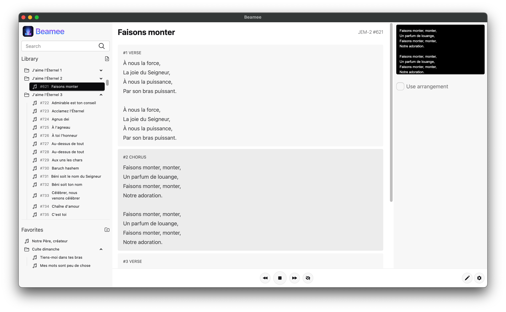
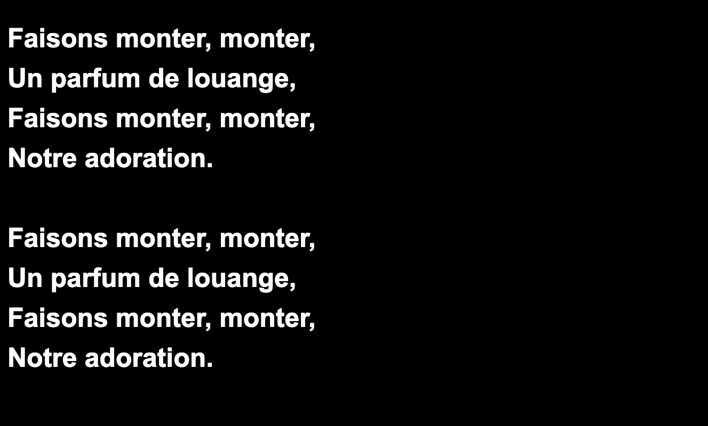

# Beamee

<p align="center">
  
</p>

<p align="center">
  A desktop lyrics projection app for worship services and live events.
</p>

<p align="center">
  
  
  
</p>

---

## About

Beamee lets a worship leader or operator control song lyrics from their laptop while a fullscreen projection window displays them on a connected projector or second screen. Songs are stored locally as JSON files, organized into collections, and can be projected verse by verse with a single click.

---

## Features

- **Song library** — organized into collections and folders, with a file-tree sidebar
- **Real-time search** — accent-insensitive search across the full library
- **Favorites & playlists** — pin songs into named folders with drag-and-drop reordering
- **Song editor** — create or edit songs with sections (verse, chorus, bridge, etc.), collection metadata, and a drag-and-drop arrangement builder
- **Projection controls** — Next / Prev / Jump to chorus / Blank screen, also accessible from the keyboard and app menu
- **Live preview** — 16:9 thumbnail in the main window showing exactly what the projector displays
- **Import / Export** — import individual JSON files or folders; export a song or the full library as a ZIP archive
- **Preferences** — font family (from local system fonts), size, text color, background color or image, line height, padding, and arrangement toggle
- **Themes** — 20+ DaisyUI themes (light, dark, cupcake, synthwave, dracula, and more) plus system auto-detect
- **Auto-update** — checks GitHub releases on startup; update progress shown in Settings

---

## Screenshots

| Main window | Projector output |
|---|---|
|  |  |

---

## Tech Stack

| Layer | Technology |
|---|---|
| Runtime | Electron 35 |
| UI | Vanilla JS (ES modules), no framework |
| Styling | Tailwind CSS v4 + DaisyUI v5 |
| Drag-and-drop | SortableJS |
| Packaging | electron-builder (asar) |
| Auto-update | electron-updater |
| Archive export | archiver |

---

## Getting Started

**Prerequisites:** Node.js (LTS recommended).

```bash
# Install dependencies
npm install

# Run the app
npm start

# Run with hot-reload (watches for file changes)
npm run watch
```

The app self-bootstraps on first launch — no setup wizard required. Song data, favorites, and preferences are created automatically in the Electron `userData` directory.

---

## Building

**Rebuild Tailwind CSS** (only needed if `renderer/css/style.css` is modified and for first run):

```bash
npm run build-tailwind   # one-time build
npm run watch-tailwind   # watch mode
```

**Create distributable packages:**

```bash
npm run dist
```

This produces platform-native packages (`.dmg` / `.zip` on macOS, NSIS installer on Windows, `.deb` / `.AppImage` on Linux) in the `dist/` directory.

**Syntax check** (no test suite exists):

```bash
node --check main.js
node --check preload.js
```

---

## Project Structure

```
beamee/
├── main.js                  # Main process: app bootstrap, IPC handlers, window management, auto-updater
├── preload.js               # Context bridge: exposes fs, path, ipcRenderer, and Sortable to the renderer
├── forge.config.js          # Electron Forge / packaging config
├── dev-app-update.yml       # Auto-updater config for development (points to GitHub repo)
├── assets/
│   └── js/
│       ├── fileController.js       # fs read/write utilities
│       ├── libraryController.js    # Walks the library dir, builds in-memory song tree and Maps
│       ├── preferencesStore.js     # Default preferences, normalization, and merge helpers
│       └── songSchema.js           # Song data model: normalization, validation, ID generation
├── renderer/
│   ├── index.html           # Main window shell (SPA entry point)
│   ├── projector.html       # Projector window
│   ├── css/
│   │   ├── style.css        # Source stylesheet (Tailwind + DaisyUI imports + custom rules)
│   │   └── output.css       # Generated Tailwind output (committed, used at runtime)
│   ├── img/                 # App logo and platform icons
│   └── js/
│       ├── router.js        # Hash-based SPA router with mount/unmount lifecycle
│       ├── renderer.js      # Library view: song list, favorites, verse display, editor, projection control
│       ├── preferences.js   # Settings view: preferences form, theme picker, updater UI
│       ├── projector.js     # Projector window: renders lyrics, applies preferences
│       └── themeUtils.js    # Resolves "system" theme to light/dark via matchMedia
│   └── views/
│       ├── library.html     # Library view HTML and <template> elements
│       └── settings.html    # Settings view HTML
├── library/                 # Legacy migration source only — not the live library
├── favorites.json           # Legacy migration source only
└── preferences.json         # Legacy migration source only
```

---

## Data Storage

All runtime data lives in the Electron **`userData`** directory — not in the repo. Typical paths:

| Platform | Path |
|---|---|
| macOS | `~/Library/Application Support/Beamee/` |
| Windows | `%APPDATA%\Beamee\` |
| Linux | `~/.config/Beamee/` |

**Songs** are `.json` files under `<userData>/library/`. Subdirectories represent collections. Example song file:

```json
{
  "schemaVersion": 1,
  "id": "amazing-grace",
  "name": "Amazing Grace",
  "authors": ["John Newton"],
  "collections": [{ "collectionId": "hymnal", "name": "Hymnal", "reference": "H", "number": 1 }],
  "sections": [
    { "id": "verse-1", "type": "verse", "title": "Verse 1", "lines": ["Amazing grace, how sweet the sound", "That saved a wretch like me"] }
  ],
  "arrangement": [{ "sectionId": "verse-1", "label": "Verse 1" }]
}
```

Valid section types: `verse`, `chorus`, `pre-chorus`, `bridge`, `intro`, `outro`, `tag`, `other`.

**Favorites** are persisted as `<userData>/favorites.json`. **Preferences** as `<userData>/preferences.json`.

---

## Architecture Notes

**Security model** — The renderer runs with `contextIsolation: true` and `nodeIntegration: false`. All Node.js and Electron access is exposed through a narrow `preload.js` context bridge (`fs`, `path`, `ipcRenderer`, `Sortable`). Main-process and renderer communicate exclusively via named IPC channels.

**Custom asset protocol** — Background images are served via the `beamee-asset://` custom protocol, which maps to files in `userData`. This avoids exposing arbitrary `file://` paths and works correctly in CSP-restricted renderer contexts (including CSS `background-image`).

**No UI framework** — The renderer uses vanilla ES modules with manual DOM construction. `<template>` elements in the HTML files serve as lightweight component blueprints for dynamically built UI (song cards, section editors, arrangement items, etc.).

**Hash-based routing** — The SPA has two routes (`#library`, `#settings`). Each view module exports `mount(root, context)` and `unmount()` lifecycle hooks. View HTML is loaded from disk at runtime via the preload bridge.

**Lazy library loading** — The in-memory song tree is built once on demand and explicitly invalidated whenever a song is saved or imported, then rebuilt on the next access.

---

## License

[ISC](https://opensource.org/licenses/ISC) © Ilans
